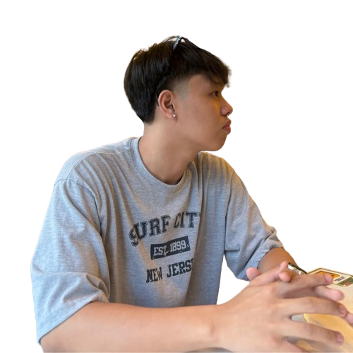

<a name="readme-top">

<br/>

<br />
<div align="center">
  <a href="https://github.com/jcserrano050105">
  <!-- TODO: If you want to add logo or banner you can add it here -->
    
  </a>
<!-- TODO: Change Title to the name of the title of your Project -->
  <h3 align="center">Seatwork 4 - Feature Display</h3>
</div>
<!-- TODO: Make a short description -->
<div align="center">
  A platform that showcases features and updates. Explore my collection of pages
</div>

<br />

<!-- TODO: Change the zyx-0314 into your github username  -->
<!-- TODO: Change the WD-Template-Project into the same name of your folder -->


---

<br />
<br />

<!-- TODO: If you want to add more layers for your readme -->
<details>
  <summary>Table of Contents</summary>
  <ol>
    <li>
      <a href="#overview">Overview</a>
      <ol>
        <li>
          <a href="#key-components">Key Components</a>
        </li>
        <li>
          <a href="#technology">Technology</a>
        </li>
      </ol>
    </li>
    <li>
      <a href="#rule,-practices-and-principles">Rules, Practices and Principles</a>
    </li>
    <li>
      <a href="#resources">Resources</a>
    </li>
  </ol>
</details>

---

## Overview

<!-- TODO: To be changed -->
<!-- The following are just sample -->
Description of the project in details.

Guiding Question:
- What is the project - The project is a Feature Display Website that showcases distinct design layouts and features using pure HTML and CSS. It consists of multiple pages, each dedicated to a different theme or subject, and includes various sections highlighting specific content through engaging visuals and interactive elements.
- Whats the purpose - The primary purpose of the project is to demonstrate the use of HTML and CSS to create visually appealing and functionally rich web pages. The website aims to showcase the capabilities of these core web technologies in building interactive and responsive user experiences.
- What are key components - The project features a main entry point with a video background and navigation links, providing an engaging introduction to the website. The website also includes two distinct feature pages. Feature Page 1 focuses on Honda City Hatchback, with sections highlighting the features of it . Feature Page 2 is dedicated to the Nike Shoes , showcasing the shoe features.
- What technology used and how it is used - The website is built using HTML to create the structure. This defines the different parts of the page, like headings, sections, paragraphs, and navigation links. The content is organized in a logical way. CSS is then used to style the HTML elements. This allows for visually appealing layouts, and advanced techniques like flexbox and grid are used to make the design responsive. Transitions and animations are also included to enhance the interactivity and overall user experience of the website.

### Key Components
<!-- TODO: List of Key Components -->
<!-- The following are just sample -->
- Landing Page
- Features Page
- Header and Footer

### Technology
<!-- TODO: List of Technology Used -->


## Rules, Practices and Principles
1. Always use `WD-` in the front of the Title of the Project for the Subject followed by your custom naming.
2. Do not rename any .html files; always use `index.html` as the filename.
3. Place Files in their respective folders.
4. All file naming are in camel case.
   - Camel case is naming format where there is no white space in separation of each words, the first word is in all lower case while the succeding words first letter are in upper followed by lower cased letters.
   - ex.: buttonAnimatedStyle.css
5. Use only `External CSS`.
6. Renaming of Pages folder names are a must, and relates to what it is doing or data it holding.
7. File Structure to follow below.

```
WD-ProjectName
└─ assets
|   └─ css
|   |   └─ style.css
|   └─ img
|   |   └─ fileWith.jpeg/.jpg/.webp/.png
|
|
└─ pages
|  └─ pageName
|     └─ assets
|     |  └─ css
|     |  |  └─ style.css
|     |  └─ img
|     |  |  └─ fileWith.jpeg/.jpg/.webp/.png
|     |
|     └─ index.html
└─ index.html
└─ readme.md
```

## Resources

<!-- TODO: Add References -->
| Title | Purpose | Link |
|-|-|-|
|Google Font | For designing the letters | https://fonts.google.com/icons?icon.query=facebook|
|Font Awesome| For the icons             | https://fontawesome.com/search?q=facebook&o=r     |
|Pinterest   | For the pictures          | https://ph.pinterest.com/pin/286119382565240637/  |
